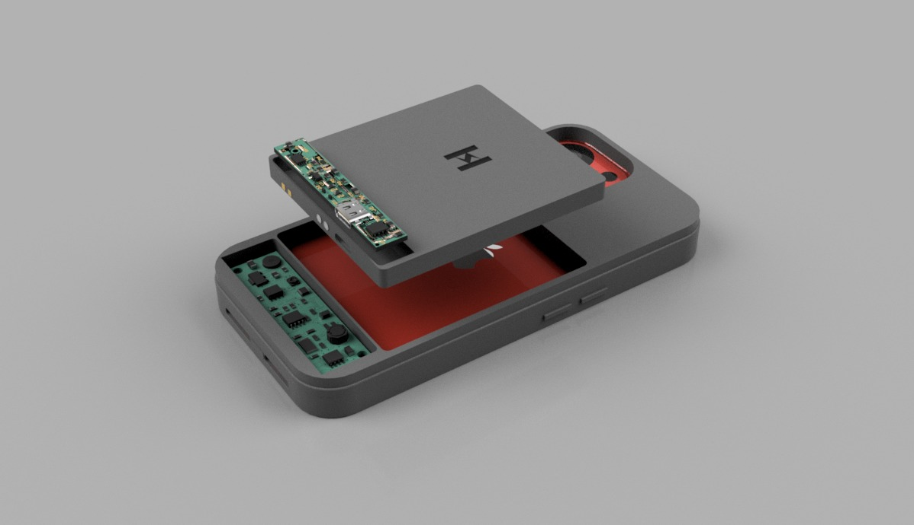
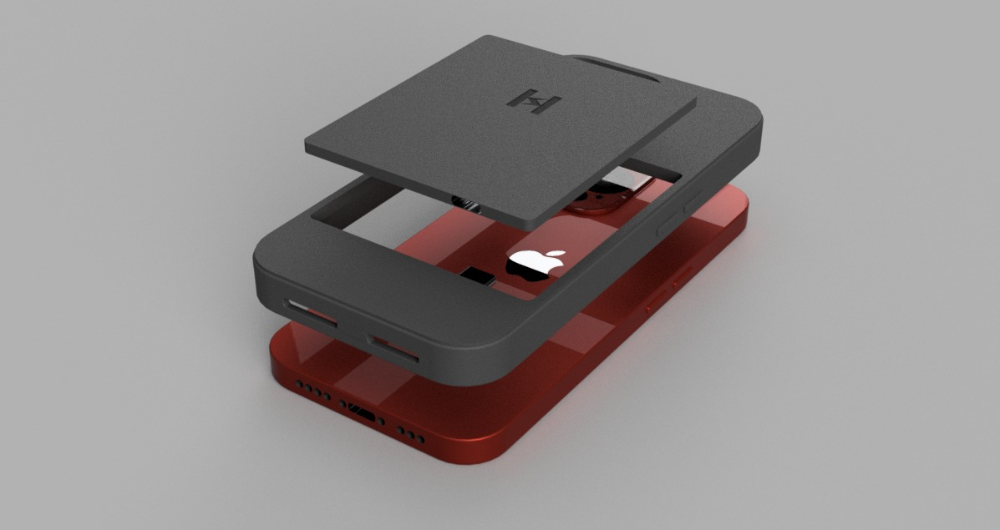
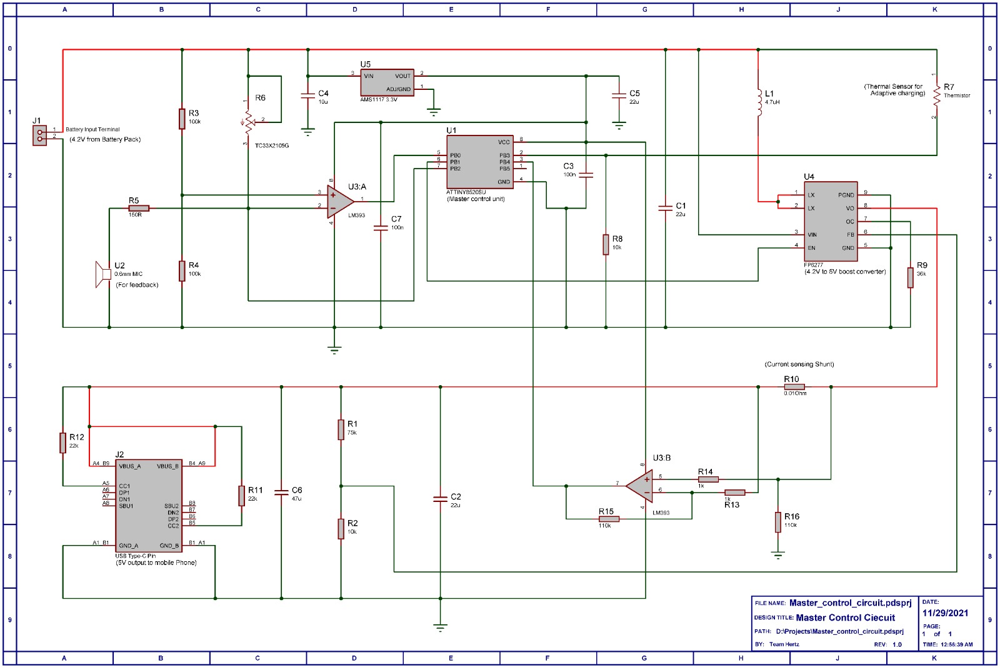
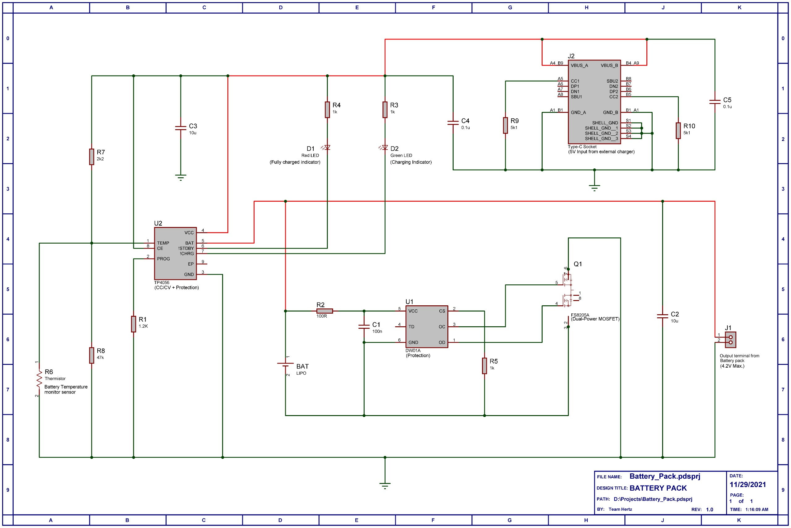

# Modular Hot-Swappable Smartphone Power Unit

## Executive Summary
A fully engineered smartphone enclosure integrating a card-based swappable battery architecture, intelligent charging control, and embedded protection systems for uninterrupted mobile power delivery.

## Problem Statement
Smartphones remain constrained by fixed internal batteries, forcing users into downtime during charging cycles. Existing power banks introduce cable dependency, increased bulk, and inconsistent power delivery. This project implements a modular power architecture to eliminate charging downtime by enabling instant battery replacement without removing the phone enclosure or interrupting usage.

## System Concept & Architecture
The system introduces a credit-card-sized battery module that can be inserted into a dedicated slot within a smartphone enclosure. When the active battery depletes, it can be replaced instantly with a charged unit.

### Core Architectural Layers:
1.  **Charging Layer**: CC/CV lithium-ion charging using TP4056 with automatic termination.
2.  **Regulation Layer**: Stable voltage output (5.1V) using AMS1117 low-dropout (LDO) regulators.
3.  **Protection Layer**: Multi-stage battery protection logic including overcharge, overcurrent, and thermal safeguards.
4.  **Control Layer**: Application-driven charging strategy for optimized battery lifespan.

## Master Control Architecture
The charging subsystem is built around a constant-current/constant-voltage architecture using TP4056, providing linear charging with thermal regulation and programmable current control. The master unit manages the overall power distribution and output regulation.

### Master Control Unit Schematic

### Technical Specifications (Master):
- **Charging Voltage**: 4.2V regulated
- **Charge Current**: Programmable up to 1A
- **Output Voltage**: 5.1V stable regulated output
- **Safety**: Thermal shutdown and internal current limiting

## Modular Battery Pack
The battery modules are designed as removable, high-capacity cards that integrate seamless hot-swapping capabilities with built-in protection circuitry.

### Battery Pack Schematic

### Technical Specifications (Battery):
- **Battery Capacity**: Dual Li-Po modules (5000mAh × 2)
- **Total Energy**: 18.5Wh × 2
- **Rated Output**: 2A (Peak up to 5A)

## Protection & Reliability
The system implements layered protection across both charging and discharging paths to ensure safe operation under dynamic load and environmental conditions:
- Overcharge & Deep discharge protection
- Overcurrent & Short circuit protection
- Thermal regulation & Shutdown

## Software Integration
The system includes an application layer that enables intelligent configuration of charging behavior and system policies:
- **Charge Scheduling**: Automated control over charging cycles.
- **Adaptive Strategy**: Algorithm-driven battery optimization.
- **Telemetry**: Real-time status monitoring and feedback.

## Engineering Outcome
A complete modular battery ecosystem was designed, implemented, and validated. The system integrates mechanical enclosure design, embedded electronics, and intelligent control systems into a production-oriented solution, demonstrating strong capability across power electronics and real-world product engineering.

[Explore full details of the Smart Swap Battery Unit](https://anandps.in/projects/hot-swappable-smartphone-power-unit/index.html)

## Project Contributors
The system was designed and implemented by:

- **Anand P S**
    - **Designation**: Firmware Systems Developer
    - **Bio**: Engineer specializing in distributed backend architectures, embedded systems, firmware development, and production-grade software design. Builds efficient, fault-tolerant systems with a focus on scalability and long-term maintainability.
    - **Links**: [LinkedIn](https://www.linkedin.com/in/anand-ps) | [GitHub](https://github.com/anand-ps) | [Email](mailto:anandps.dev@gmail.com)

- **Gopika Gopikrishnan**
    - **Designation**: Software Developer
    - **Bio**: Software developer specializing in distributed systems and scalable backend architecture. Experienced in building high-performance applications using React, TypeScript, Node.js, and Go, with expertise in databases like Aerospike and ArangoDB. Focused on performance optimization, system reliability, and designing robust, production-grade solutions.
    - **Links**: [LinkedIn](https://www.linkedin.com/in/gopika-g-krishnan) | [GitHub](https://github.com/gopikagopikrishnan) | [Email](mailto:gopikagopikrishnan@gmail.com)

---
© 2024 Anand P S. All rights reserved.
